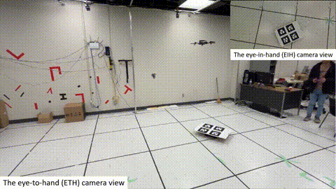
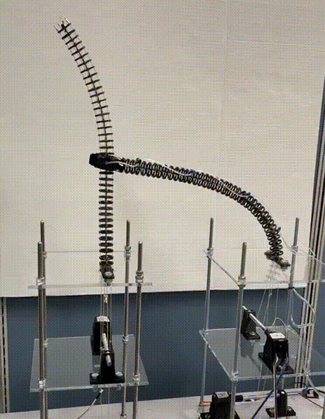

### Hello | Bonjour | Guten Tag | سلام | こんにちは 👋

Hi, I'm **Shayan Sepahvand**, a PhD candidate in Mechanical Engineering (Robotics) at **Toronto Metropolitan University (TMU)**, working in the **Robotics, Mechatronics and Automation Laboratory (RMAL)**.

My research focuses on **aerial manipulation, continuum robotics, visual servoing, force control, and autonomous robotic systems**. I am particularly interested in developing perception and control methods for **tendon-driven aerial continuum manipulators**, including vision-based manipulation, hybrid vision/force control, and learning-based robotic control.

---

### 🔬 Research Interests

- 🤖 Continuum Robotics
- 🚁 Aerial Manipulation
- 👁️ Visual Servoing
- 🦾 Hybrid Vision/Force Control
- 🧠 Deep Learning for Robotics
- 📐 Robot Kinematics and Dynamics
- 🛰️ Autonomous Robotic Systems
- 🧭 Motion Planning and Control

---

### 🛠️ Tools & Technologies

- **Programming:** C++, Python, MATLAB
- **Robotics:** ROS / ROS 2, MAVROS, RViz
- **Computer Vision:** OpenCV, Visual Servoing, Feature Matching
- **Simulation & Modeling:** MATLAB/Simulink, Cosserat-Rod Modeling
- **Control:** Sliding-Mode Control, Fixed-Time Control, Adaptive Control, IBVS
- **Hardware:** UAVs, Continuum Manipulators, Force/Torque Sensors, RGB-D Cameras

---

### 🤖 Selected Projects

I enjoy working on challenging robotics projects involving aerial manipulation, continuum robots, perception, and control.

| **[Robust Vision-based Control of a Quadrotor](https://github.com/Shayan-Sepahvand/ROS-IBVS)** | **[IK Estimation of Continuum Robot](https://github.com/Shayan-Sepahvand/CCR-IK.git)** |
| ------------------------------------------------ | ------------------------------- |
| 

 
 |  
 |
| **Visual Servoing for Continuum Robots** | **Dual-Arm Robotic Manipulation** |
|  |  |

---

### 📚 Current Research

My current research investigates control and perception methods for **tendon-driven aerial continuum manipulators (TD-ACMs)**, including:

- Image-Based Visual Servoing (IBVS)
- Hybrid visual and force control
- Robust and fixed-time control
- Singularity-aware visual feature selection
- Force and wrench estimation
- Dual-arm aerial manipulation
- Valve-turning and contact-rich manipulation
- Continuum robot modeling using Cosserat-rod formulations

---

### 📄 Research & Publications

My research has been published and presented in robotics, control, computer vision, and autonomous-systems venues.

You can find more information about my publications and research here:

- 🎓 [**Google Scholar**](https://scholar.google.com/citations?user=rj90IiIAAAAJ&hl=en)
- 🔬 **ResearchGate:** [Add your ResearchGate link]
- 🆔 [**ORCID**](https://orcid.org/0000-0001-7023-3326)
- 💼 [**LinkedIn**](https://ca.linkedin.com/in/shayan-sepahvand-ba9977176) 
- 🌐 **Personal Website:** [Add your website link]

---

### 📫 Connect With Me

I am always interested in discussions and collaborations related to:

**Robotics · Aerial Manipulation · Continuum Robots · Visual Servoing · Robot Control · Autonomous Systems**

---

<!--
Replace YOUR_GITHUB_USERNAME with your GitHub username.

You can also replace the GIFs under ./assets/ with videos/GIFs from your own robotics projects.
-->
